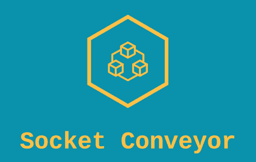

<p align="center">

</p>

<p>
  <a href="https://www.npmjs.com/package/socket-conveyor-client" target="_blank">
    
  </a>
</p>


> A client for the php package kanata-php/socket-conveyor

### 🏠 [Homepage](https://github.com/kanata-php/socket-conveyor-client#readme)

## Prerequisites

- npm >=5.5.0
- node >=9.3.0

## Install

```sh
npm install socket-conveyor-client
```


## Description


This is a client for the [Socket Conveyor](https://github.com/kanata-php/socket-conveyor) PHP package..


## Usage


To use this package, once it is installed, the following example shows how it works.

```html
<div>
    <div><button onclick="connection.send('base', 'base-action')">Base Action</button></div>
    <div><button onclick="connection.send('first', 'example-first-action')">First Action</button></div>
    <div><button onclick="connection.send('second', 'example-second-action')">Second Action</button></div>
    <div id="output"></div>
</div>
<script type="module" type="text/javascript">

    import Conveyor from './node_modules/socket-conveyor-client/index.js';

    var connection = new Conveyor({
        channel: 'actions-channel',
        listen: ['example-first-action'],
        onMessage: (e) => {
            document.getElementById('output').innerHTML = e;
        },
        onReady: () => {
            connection.send('Welcome!');
        },
    });

</script>
```

This package has a few defaults:

```
protocol: 'ws'
uri: '127.0.0.1'
port: 8000
channel: null
```

With the previous example your html client will try to connect to `ws://127.0.0.1:8000`. This client will connect to the channel `actions-channel`, and will listen to `example-first-action` actions. That said, any message sent to that **channel** and **action**, will be received at the `OnMessage` callback.

## Author

👤 **Savio Resende**

* Website: https://savioresende.com.br
* GitHub: [@lotharthesavior](https://github.com/lotharthesavior)

## Show your support

Give a ⭐️ if this project helped you!

## 📝 License

Copyright © 2022 [Savio Resende](https://github.com/lotharthesavior).
